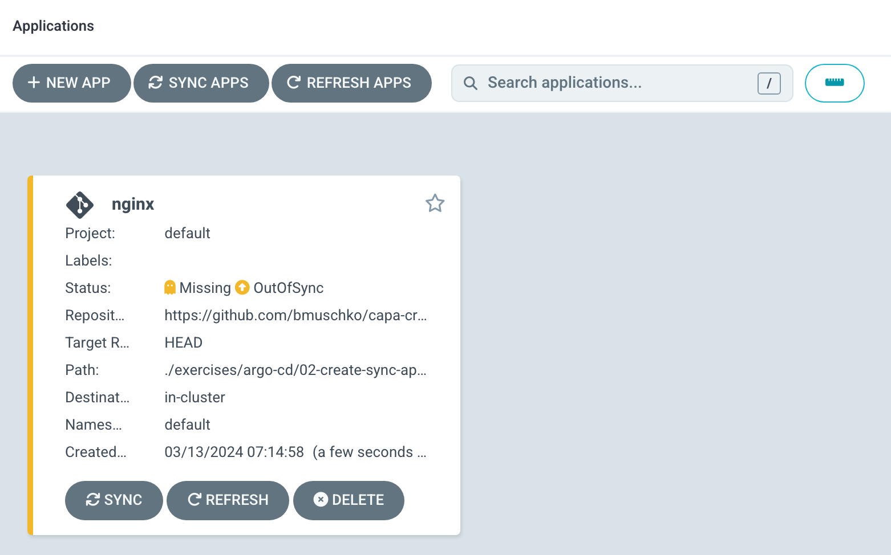

# Solution

The YAML manifests define a Deployment and a Service. Create a new application from the Argo CD UI by clicking the button _New App_. Enter the configuration data given in the instructions.


Click the _Create_ button. You will see that the application is "OutOfSync" which means that the cluster state doesn't reflect the desired state.



Click the _Sync_ button to apply the changes. Stick with the default options and press the _Synchronize_ button.


Click on the application panel. The application view will render the objects defined by the manifests. After syncing the application, all objects should indicate a "Healthy" status.


You can list those objects using `kubectl` as well.

```
$ kubectl get deployments,services,pods
NAME                    READY   UP-TO-DATE   AVAILABLE   AGE
deployment.apps/nginx   3/3     3            3           14m

NAME                 TYPE        CLUSTER-IP      EXTERNAL-IP   PORT(S)   AGE
service/kubernetes   ClusterIP   10.96.0.1       <none>        443/TCP   42m
service/nginx        ClusterIP   10.108.146.36   <none>        80/TCP    14m

NAME                        READY   STATUS    RESTARTS   AGE
pod/nginx-f9c6dcdc5-798dj   1/1     Running   0          14m
pod/nginx-f9c6dcdc5-nzkhx   1/1     Running   0          14m
pod/nginx-f9c6dcdc5-zkrqq   1/1     Running   0          14m
```

You can list all applications using the `argocd` CLI.

```
$ argocd app list
NAME          CLUSTER                         NAMESPACE  PROJECT  STATUS  HEALTH   SYNCPOLICY  CONDITIONS  REPO                                           PATH                                                  TARGET
argocd/nginx  https://kubernetes.default.svc  default    default  Synced  Healthy  <none>      <none>      https://github.com/bmuschko/capa-crash-course  ./exercises/argo-cd/02-create-sync-application/nginx  HEAD
```

Use the following command to view details of the `nginx` application.

```
$ argocd app get nginx
Name:               argocd/nginx
Project:            default
Server:             https://kubernetes.default.svc
Namespace:          default
URL:                https://localhost:8080/applications/nginx
Repo:               https://github.com/bmuschko/capa-crash-course
Target:             HEAD
Path:               ./exercises/argo-cd/02-create-sync-application/nginx
SyncWindow:         Sync Allowed
Sync Policy:        <none>
Sync Status:        Synced to HEAD (b50dd4f)
Health Status:      Healthy

GROUP  KIND        NAMESPACE  NAME   STATUS  HEALTH   HOOK  MESSAGE
       Service     default    nginx  Synced  Healthy        service/nginx created
apps   Deployment  default    nginx  Synced  Healthy        deployment.apps/nginx created
```

The `app history` command shows the application deployment history. We only deployed a single revision.

```
$ argocd app history nginx
ID  DATE                           REVISION
0   2024-03-13 07:21:33 -0600 MDT  HEAD (b50dd4f)
```

Delete the application using the CLI.

```
$ argocd app delete nginx
Are you sure you want to delete 'nginx' and all its resources? [y/n] y
application 'nginx' deleted
```

Create the application again using the CLI.

```
$ argocd app create nginx --project default --repo https://github.com/bmuschko/capa-crash-course --path "./exercises/argo-cd/02-create-sync-application/nginx" --dest-server https://kubernetes.default.svc --dest-namespace default
application 'nginx' created
```

The current status of the application will be "OutOfSync". Synchronize the application using the CLI.

```
$ argocd app sync nginx
TIMESTAMP                  GROUP        KIND   NAMESPACE                  NAME    STATUS    HEALTH        HOOK  MESSAGE
2024-03-13T07:50:58-06:00            Service     default                 nginx  OutOfSync  Missing
2024-03-13T07:50:58-06:00   apps  Deployment     default                 nginx  OutOfSync  Missing
2024-03-13T07:50:58-06:00            Service     default                 nginx  OutOfSync  Missing              service/nginx created
2024-03-13T07:50:58-06:00   apps  Deployment     default                 nginx  OutOfSync  Missing              deployment.apps/nginx created
2024-03-13T07:50:58-06:00            Service     default                 nginx    Synced  Healthy                  service/nginx created
2024-03-13T07:50:58-06:00   apps  Deployment     default                 nginx    Synced  Progressing              deployment.apps/nginx created

Name:               argocd/nginx
Project:            default
Server:             https://kubernetes.default.svc
Namespace:          default
URL:                https://localhost:8080/applications/nginx
Repo:               https://github.com/bmuschko/capa-crash-course
Target:
Path:               ./exercises/argo-cd/02-create-sync-application/nginx
SyncWindow:         Sync Allowed
Sync Policy:        <none>
Sync Status:        Synced to  (b50dd4f)
Health Status:      Progressing

Operation:          Sync
Sync Revision:      b50dd4fd6b5d4752dcb8f24083c2482da6ba5a55
Phase:              Succeeded
Start:              2024-03-13 07:50:58 -0600 MDT
Finished:           2024-03-13 07:50:58 -0600 MDT
Duration:           0s
Message:            successfully synced (all tasks run)

GROUP  KIND        NAMESPACE  NAME   STATUS  HEALTH       HOOK  MESSAGE
       Service     default    nginx  Synced  Healthy            service/nginx created
apps   Deployment  default    nginx  Synced  Progressing        deployment.apps/nginx created
```