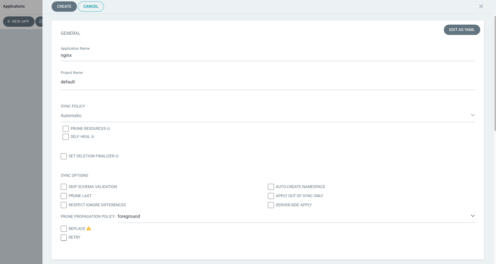
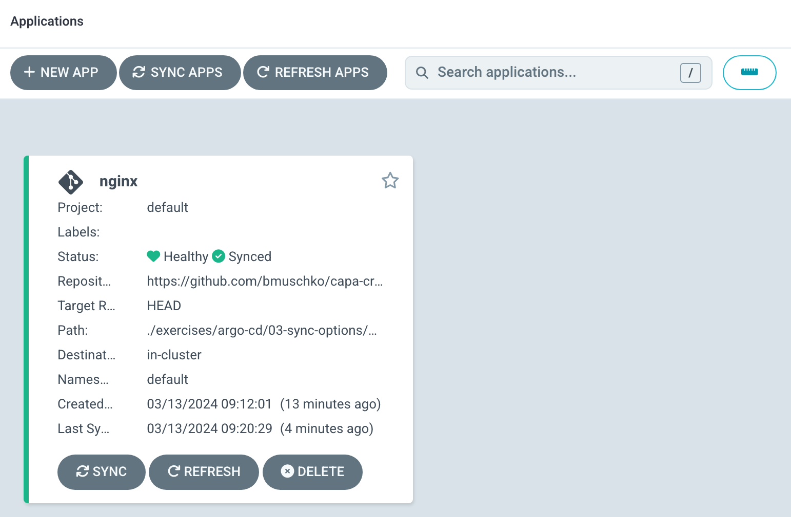
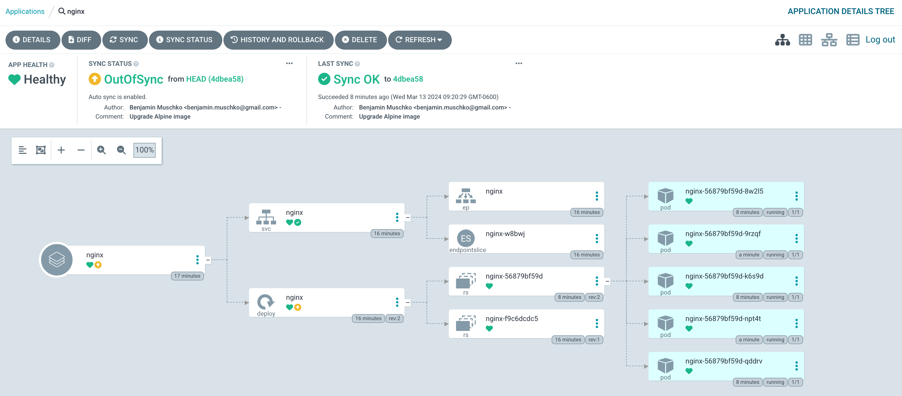
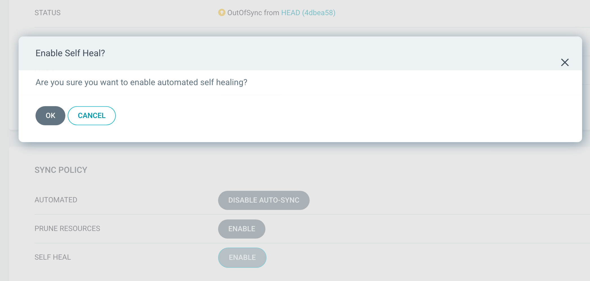
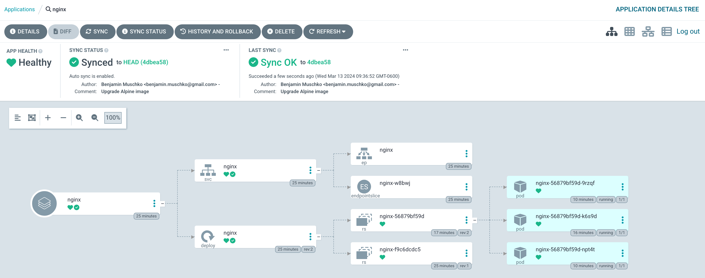

# Solution

The YAML manifests define a Deployment and a Service. Create a new application from the Argo CD UI by clicking the button _New App_. Enter the configuration data given in the instructions.



Click the _Create_ button. You will see that the application is "Synced" which means that the cluster state reflects the desired state.


Change the Deployment YAML manifest so that it points to the new container image at `exercises/argo-cd/03-sync-options/nginx/nginx-deployment.yaml`.

```yaml
apiVersion: apps/v1
kind: Deployment
metadata:
  name: nginx
spec:
  ...
    spec:
      containers:
      - image: nginx:1.25.4-alpine
...
```

Commit and push the change.

```
$ git commit exercises/argo-cd/03-sync-options/nginx/nginx-deployment.yaml -m "Upgrade Alpine image"
$ git push origin main
```

After waiting for 3 minutes, you will see that the application is "Synced" which means that the cluster state reflects the desired state.



Change the number of replicas to 5 using the following imperative command.

```
$ kubectl scale deployment nginx --replicas=5
deployment.apps/nginx scaled
```

As a result, the application will indicate the "OutOfSync" status. The details of the application shows 5 replicas.



Enable the "Self Heal" option in the "Sync Policy" section.



The application will be fixed automatically by reverting the number of replicas to 3, as configured in the Deployment YAML manifest.



Delete the Service YAML manifest. Commit and push the change.

```
$ git rm exercises/argo-cd/03-sync-options/nginx/nginx-service.yaml
$ git commit . -m "Remove Service YAML manifest"
$ git push origin main
```