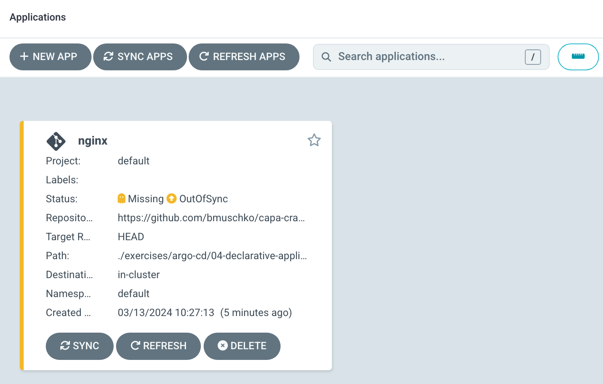

# Solution

Define an Application YAML manifest in the file `nginx-application.yaml`. The contents could look as follows. For more information, see the [documentation](https://argo-cd.readthedocs.io/en/stable/operator-manual/declarative-setup/#applications).

```yaml
apiVersion: argoproj.io/v1alpha1
kind: Application
metadata:
  name: nginx
  namespace: argocd
spec:
  project: default
  source:
    repoURL: https://github.com/bmuschko/capa-crash-course.git
    targetRevision: HEAD
    path: ./exercises/argo-cd/04-declarative-application/nginx
  destination:
    server: https://kubernetes.default.svc
    namespace: default
```

Apply the changes by running the following command.

```
$ kubectl apply -f nginx-application.yaml
application.argoproj.io/nginx created
```

As a result, the application will be accessible through the UI. Given the current configuration, the application will indicate the "OutOfSync" status.



Delete the application. The application's objects will be deleted and the application will be removed from the UI.

```
$ kubectl delete -f nginx-application.yaml
application.argoproj.io "nginx" deleted
```

Create two Application YAML manifests that live in the same directory. Make sure to provide unique names. Then create a new application using the UI or CLI. The following commands uses the CLI and points to a folder that already contains the Application YAML manifests.

```
$ argocd app create apps --dest-namespace argocd --dest-server https://kubernetes.default.svc --repo https://github.com/bmuschko/capa-crash-course.git --path ./exercises/argo-cd/04-declarative-application/solution/app-of-apps
```