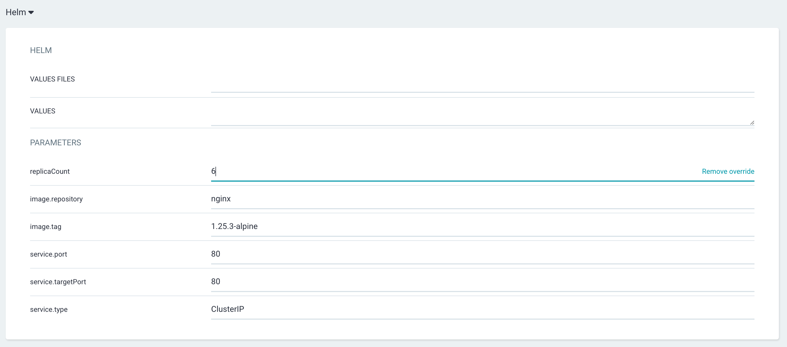
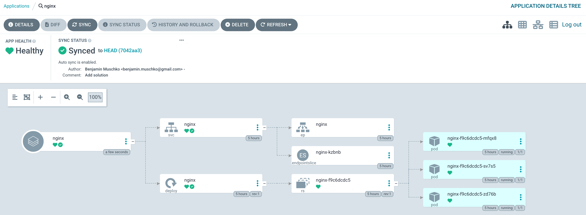

# Solution

Create a new application from the Argo CD UI by clicking the button _New App_. Enter the configuration data given in the instructions. In the Helm section, change the value of the parameter `replicaCount` to 6. 



The details of the application will show 6 managed replicas.



Delete the application from the CLI.

```
$ argocd app delete nginx
Are you sure you want to delete 'nginx' and all its resources? [y/n] y
application 'nginx' deleted
```

Create the application from the CLI. Individual Helm values can be provided with the `--helm-set-string` flag.

```
$ argocd app create nginx --repo https://github.com/bmuschko/capa-crash-course --path "./exercises/argo-cd/05-helm-deployment/nginx" --project default --sync-policy auto --dest-server https://kubernetes.default.svc --dest-namespace default --helm-set-string 'replicaCount=6'
application 'nginx' created
```

Argo CD runs the `helm template` command to render the YAML manifests for an application. It does not use the traditional `helm install` command. Therefore, trying to render the installed charts will not return the chart above.

```
$ helm list --all-namespaces
NAME	NAMESPACE	REVISION	UPDATED	STATUS	CHART	APP VERSION
```