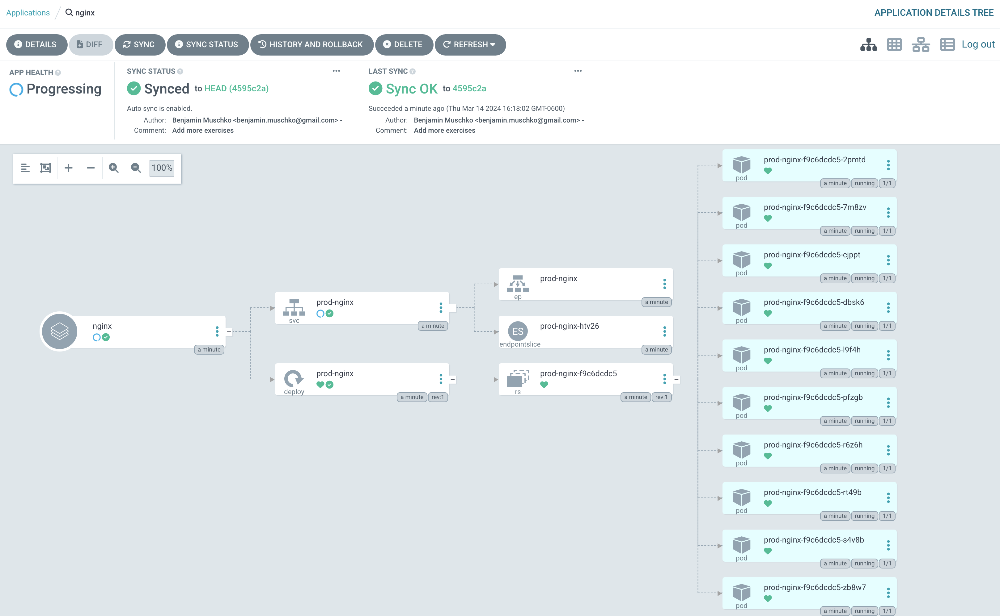
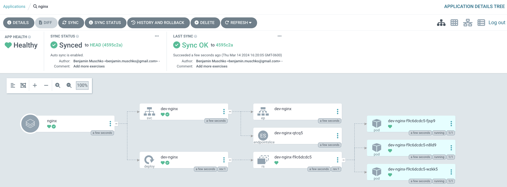

# Solution

Create a new application from the Argo CD UI by clicking the button _New App_. Enter the configuration data given in the instructions. Click the _Create_ button.



Delete the application from the CLI.

```
$ argocd app delete nginx
Are you sure you want to delete 'nginx' and all its resources? [y/n] y
application 'nginx' deleted
```

Create the application from the CLI. This time, select the `dev` overlay.

```
$ argocd app create nginx --repo https://github.com/bmuschko/capa-crash-course --path "./exercises/argo-cd/06-kustomize-deployment/nginx/overlays/dev" --project default --sync-policy auto --dest-server https://kubernetes.default.svc --dest-namespace default
application 'nginx' created
```

