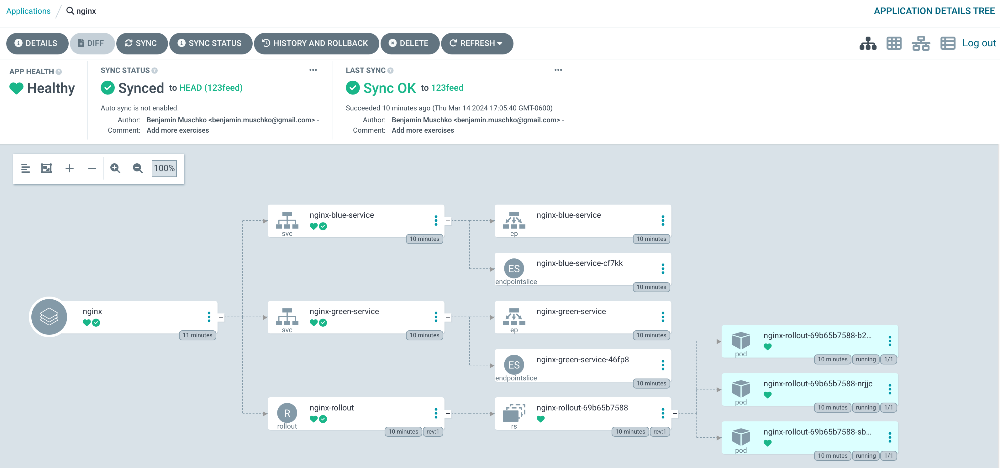
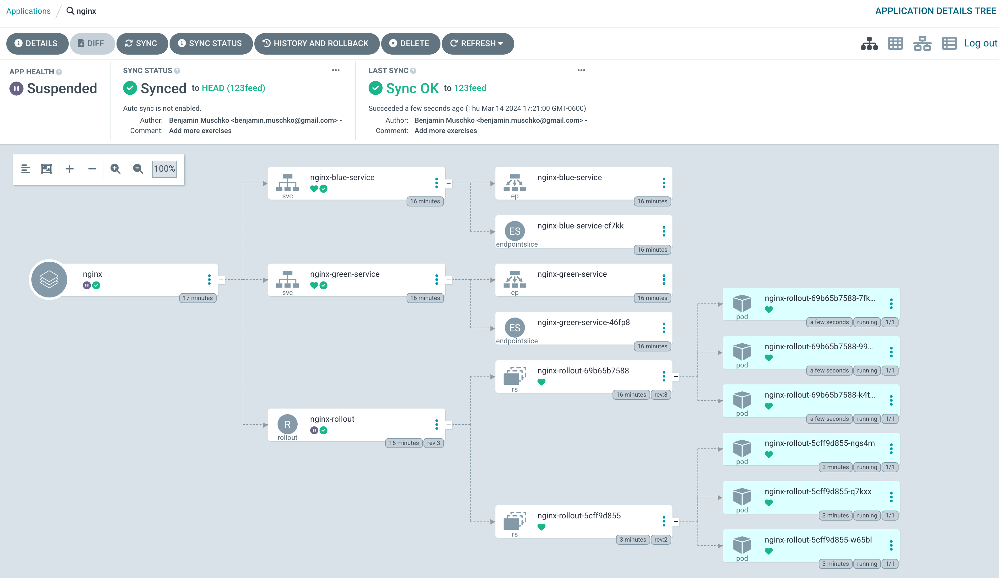

# Solution

Create a new application from the Argo CD UI by clicking the button _New App_. Enter the configuration data given in the instructions. Click the _Create_ button. After manually syncing the application, it should transition into the "Healthy" status.



Listing all rollouts will only show a single one.

```
$ kubectl argo rollouts list rollouts
NAME           STRATEGY   STATUS        STEP  SET-WEIGHT  READY  DESIRED  UP-TO-DATE  AVAILABLE
nginx-rollout  BlueGreen  Healthy       -     -           3/3    3        3           3
```

The status of the rollout returns "Healthy".

```
$ kubectl argo rollouts status nginx-rollout
Healthy
```

The details of the rollout will only list a single revision.

```
$ kubectl argo rollouts get rollout nginx-rollout
Name:            nginx-rollout
Namespace:       default
Status:          ✔ Healthy
Strategy:        BlueGreen
Images:          nginx:1.25.3-alpine (stable, active)
Replicas:
  Desired:       3
  Current:       3
  Updated:       3
  Ready:         3
  Available:     3

NAME                                       KIND        STATUS     AGE  INFO
⟳ nginx-rollout                            Rollout     ✔ Healthy  10m
└──# revision:1
   └──⧉ nginx-rollout-69b65b7588           ReplicaSet  ✔ Healthy  10m  stable,active
      ├──□ nginx-rollout-69b65b7588-b2bjq  Pod         ✔ Running  10m  ready:1/1
      ├──□ nginx-rollout-69b65b7588-nrjjc  Pod         ✔ Running  10m  ready:1/1
      └──□ nginx-rollout-69b65b7588-sbqgv  Pod         ✔ Running  10m  ready:1/1
```

You can make a call to the blue and green Service. Both Services will route traffic to the initial revision of the application thar run the container image, 1.25.3.

```
$ kubectl run tmp --image=alpine/curl:3.14 --restart=Never -it --rm -- curl -sI nginx-blue-service.default.svc.cluster.local:80 | grep Server
Server: nginx/1.25.3
$ kubectl run tmp --image=alpine/curl:3.14 --restart=Never -it --rm -- curl -sI nginx-green-service.default.svc.cluster.local:81 | grep Server
Server: nginx/1.25.3
```

Next up, let's roll out the change of the container image. Run the following imperative command to signal to the Rollout that you want to create a new ReplicaSet that controls replicas with the container image `nginx:1.25.4-alpine`.

```
$ kubectl argo rollouts set image nginx-rollout nginx=nginx:1.25.4-alpine
rollout "nginx-rollout" image updated
```

Argo Rollouts created a new ReplicaSet that manages the new revision of the application. The application was set to "Suspended".



Both application versions run in parallel and can be reached independently through their Services.

```
$ kubectl argo rollouts get rollout nginx-rollout
Name:            nginx-rollout
Namespace:       default
Status:          ॥ Paused
Message:         BlueGreenPause
Strategy:        BlueGreen
Images:          nginx:1.25.3-alpine (stable, active)
                 nginx:1.25.4-alpine (preview)
Replicas:
  Desired:       3
  Current:       6
  Updated:       3
  Ready:         3
  Available:     3

NAME                                       KIND        STATUS     AGE  INFO
⟳ nginx-rollout                            Rollout     ॥ Paused   12m
├──# revision:2
│  └──⧉ nginx-rollout-5cff9d855            ReplicaSet  ✔ Healthy  11m  preview
│     ├──□ nginx-rollout-5cff9d855-6zhdr   Pod         ✔ Running  11m  ready:1/1
│     ├──□ nginx-rollout-5cff9d855-gt96l   Pod         ✔ Running  11m  ready:1/1
│     └──□ nginx-rollout-5cff9d855-qpjvj   Pod         ✔ Running  11m  ready:1/1
└──# revision:1
   └──⧉ nginx-rollout-69b65b7588           ReplicaSet  ✔ Healthy  12m  stable,active
      ├──□ nginx-rollout-69b65b7588-dpvvh  Pod         ✔ Running  12m  ready:1/1
      ├──□ nginx-rollout-69b65b7588-f7dw8  Pod         ✔ Running  12m  ready:1/1
      └──□ nginx-rollout-69b65b7588-xkjgl  Pod         ✔ Running  12m  ready:1/1
```

You can reach both application versions by making HTTP calls to the corresponding Services. The blue Service will route traffic to the inital application version, the green Service will route traffic to the new application version.

```
$ kubectl run tmp --image=alpine/curl:3.14 --restart=Never -it --rm -- curl -sI nginx-blue-service.default.svc.cluster.local:80 | grep Server
Server: nginx/1.25.3
$ kubectl run tmp --image=alpine/curl:3.14 --restart=Never -it --rm -- curl -sI nginx-green-service.default.svc.cluster.local:81 | grep Server
Server: nginx/1.25.4
```

Promoting the rollout will make revision 2 active, and shut down revision 1 over time.

```
$ kubectl argo rollouts promote nginx-rollout
rollout 'nginx-rollout' promoted
```

You will see that the initial revision will be scaled down while the second revision becomes active. This process may take a little while. Executing the following command with the `--watch` will show those changes as they occur.

```
$ kubectl argo rollouts get rollout nginx-rollout
Name:            nginx-rollout
Namespace:       default
Status:          ✔ Healthy
Strategy:        BlueGreen
Images:          nginx:1.25.3-alpine (stable, active)
Replicas:
  Desired:       3
  Current:       3
  Updated:       3
  Ready:         3
  Available:     3

NAME                                       KIND        STATUS        AGE   INFO
⟳ nginx-rollout                            Rollout     ✔ Healthy     2m8s
├──# revision:3
│  └──⧉ nginx-rollout-69b65b7588           ReplicaSet  ✔ Healthy     2m8s  stable,active
│     ├──□ nginx-rollout-69b65b7588-dsfds  Pod         ✔ Running     2m8s  ready:1/1
│     ├──□ nginx-rollout-69b65b7588-jwj9z  Pod         ✔ Running     2m8s  ready:1/1
│     └──□ nginx-rollout-69b65b7588-wgnlh  Pod         ✔ Running     2m8s  ready:1/1
└──# revision:2
   └──⧉ nginx-rollout-5cff9d855            ReplicaSet  • ScaledDown  56s
```

Both Services will exclusively route traffic to the new application version.

```
$ kubectl run tmp --image=alpine/curl:3.14 --restart=Never -it --rm -- curl -sI nginx-blue-service.default.svc.cluster.local:80 | grep Server
Server: nginx/1.25.4
$ kubectl run tmp --image=alpine/curl:3.14 --restart=Never -it --rm -- curl -sI nginx-green-service.default.svc.cluster.local:81 | grep Server
Server: nginx/1.25.4
```