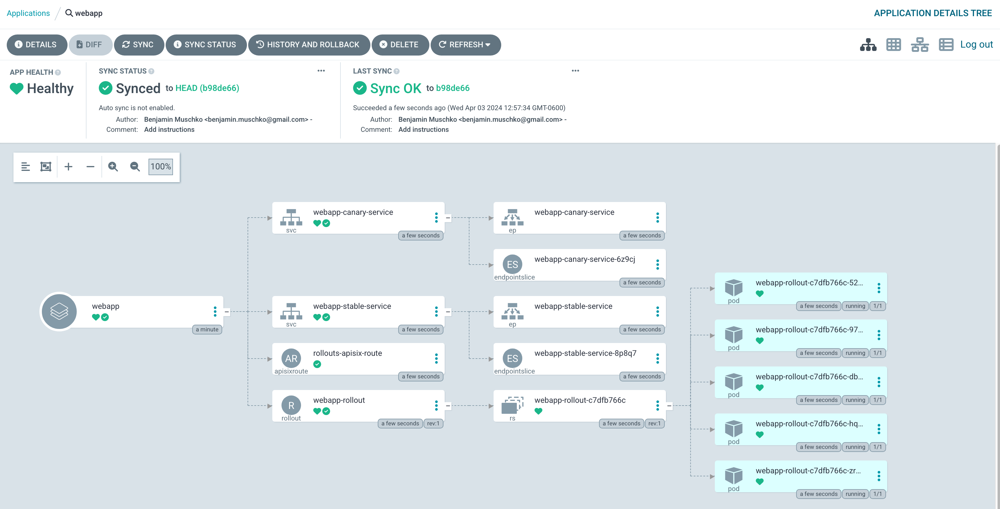
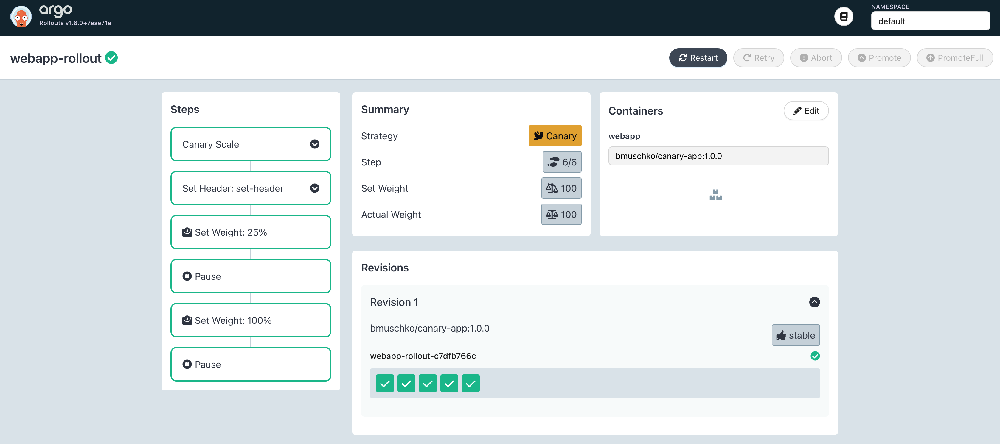
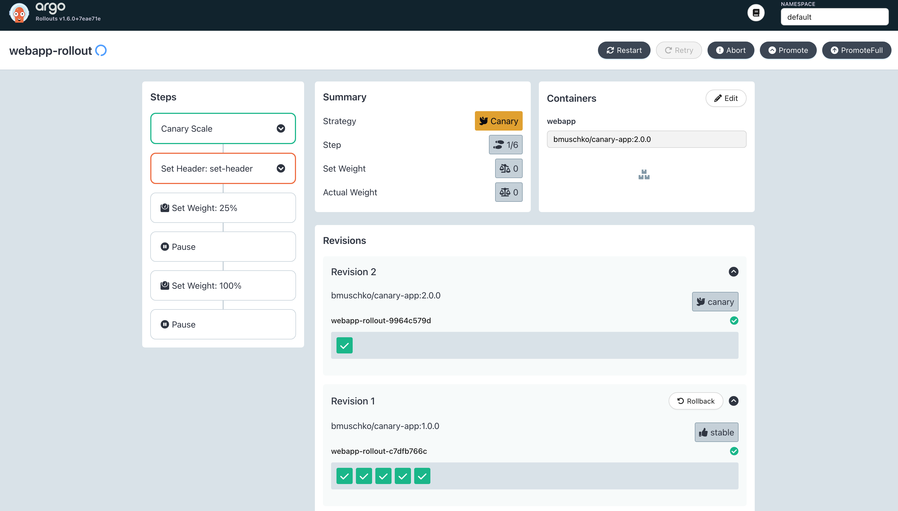
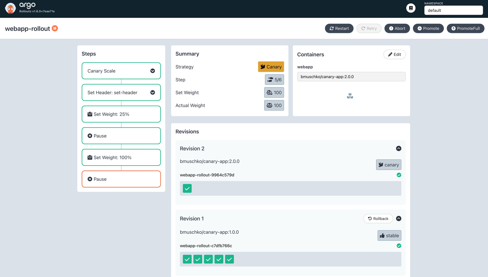
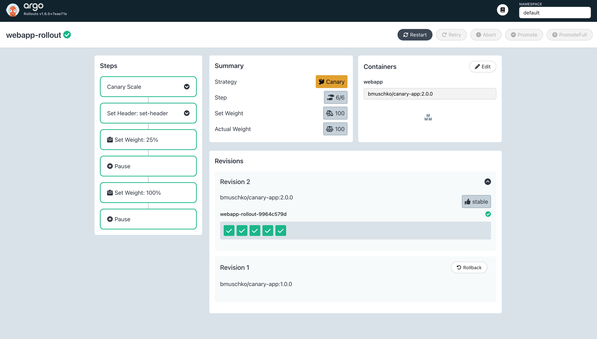

# Solution

Install APISIX and the ingress controller using the shell script `install-apisix.sh`.

```
$ ./install-apisix.sh
"apisix" already exists with the same configuration, skipping
"bitnami" already exists with the same configuration, skipping
Hang tight while we grab the latest from your chart repositories...
...Successfully got an update from the "apisix" chart repository
Update Complete. ⎈Happy Helming!⎈
NAME: apisix
LAST DEPLOYED: Wed Apr  3 12:53:23 2024
NAMESPACE: ingress-apisix
STATUS: deployed
REVISION: 1
TEST SUITE: None
NOTES:
1. Get the application URL by running these commands:
  export NODE_PORT=$(kubectl get --namespace ingress-apisix -o jsonpath="{.spec.ports[0].nodePort}" services apisix-gateway)
  export NODE_IP=$(kubectl get nodes --namespace ingress-apisix -o jsonpath="{.items[0].status.addresses[0].address}")
  echo http://$NODE_IP:$NODE_PORT
```

Create a new application from the Argo CD UI by clicking the button _New App_. Enter the configuration data given in the instructions. Click the _Create_ button. After manually syncing the application, it should transition into the "Healthy" status.



Listing all rollouts will only show a single one.

```
$ kubectl argo rollouts list rollouts
NAME            STRATEGY   STATUS        STEP  SET-WEIGHT  READY  DESIRED  UP-TO-DATE  AVAILABLE
webapp-rollout  Canary     Healthy       6/6   100         5/5    5        5           5
```

The details of the rollout will only list a single revision.

```
$ kubectl argo rollouts get rollout webapp-rollout
Name:            webapp-rollout
Namespace:       default
Status:          ✔ Healthy
Strategy:        Canary
  Step:          6/6
  SetWeight:     100
  ActualWeight:  100
Images:          bmuschko/canary-app:1.0.0 (stable)
Replicas:
  Desired:       5
  Current:       5
  Updated:       5
  Ready:         5
  Available:     5

NAME                                       KIND        STATUS     AGE    INFO
⟳ webapp-rollout                           Rollout     ✔ Healthy  2m20s
└──# revision:1
   └──⧉ webapp-rollout-c7dfb766c           ReplicaSet  ✔ Healthy  2m16s  stable
      ├──□ webapp-rollout-c7dfb766c-52m56  Pod         ✔ Running  2m16s  ready:1/1
      ├──□ webapp-rollout-c7dfb766c-97p42  Pod         ✔ Running  2m16s  ready:1/1
      ├──□ webapp-rollout-c7dfb766c-dbcdc  Pod         ✔ Running  2m16s  ready:1/1
      ├──□ webapp-rollout-c7dfb766c-hqgn7  Pod         ✔ Running  2m16s  ready:1/1
      └──□ webapp-rollout-c7dfb766c-zrqtn  Pod         ✔ Running  2m16s  ready:1/1
```

The Argo Rollouts Dashboard shows the intitial ReplicaSet.



In a new terminal, determine the IP address and port of the `apisix-gateway` Service.

```
$ minikube service apisix-gateway --url -n ingress-apisix
http://127.0.0.1:65174
❗  Because you are using a Docker driver on darwin, the terminal needs to be open to run it.
```

Calling the gateway Service will always return version 1.0.0.

```
$ curl --location "localhost:65174" -H "Host: canary-rollout.local"
{"version":"1.0.0"}
```

Next up, let's roll out the change of the container image. Run the following imperative command to signal to the Rollout that you want to create a new ReplicaSet that controls replicas with the container image `bmuschko/canary-app:2.0.0`.

```
$ kubectl argo rollouts set image webapp-rollout webapp=bmuschko/canary-app:2.0.0
rollout "webapp-rollout" image updated
```

Argo Rollouts created a new ReplicaSet that manages the new revision of the application. The application was set to "Progressing". Both application versions run in parallel and can be reached independently through their Services. The canary ReplicaSet only runs in a single replica.

```
$ kubectl argo rollouts get rollout webapp-rollout
Name:            webapp-rollout
Namespace:       default
Status:          ◌ Progressing
Message:         more replicas need to be updated
Strategy:        Canary
  Step:          1/6
  SetWeight:     0
  ActualWeight:  0
Images:          bmuschko/canary-app:1.0.0 (stable)
                 bmuschko/canary-app:2.0.0 (canary)
Replicas:
  Desired:       5
  Current:       6
  Updated:       1
  Ready:         6
  Available:     6

NAME                                       KIND        STATUS         AGE    INFO
⟳ webapp-rollout                           Rollout     ◌ Progressing  9m28s
├──# revision:2
│  └──⧉ webapp-rollout-9964c579d           ReplicaSet  ✔ Healthy      2m1s   canary
│     └──□ webapp-rollout-9964c579d-q8jnd  Pod         ✔ Running      2m1s   ready:1/1
└──# revision:1
   └──⧉ webapp-rollout-c7dfb766c           ReplicaSet  ✔ Healthy      9m24s  stable
      ├──□ webapp-rollout-c7dfb766c-52m56  Pod         ✔ Running      9m24s  ready:1/1
      ├──□ webapp-rollout-c7dfb766c-97p42  Pod         ✔ Running      9m24s  ready:1/1
      ├──□ webapp-rollout-c7dfb766c-dbcdc  Pod         ✔ Running      9m24s  ready:1/1
      ├──□ webapp-rollout-c7dfb766c-hqgn7  Pod         ✔ Running      9m24s  ready:1/1
      └──□ webapp-rollout-c7dfb766c-zrqtn  Pod         ✔ Running      9m24s  ready:1/1
```

The Argo Rollouts Dashboard shows both ReplicaSets.



Calling the gateway Service will always return version 1.0.0 still.

```
$ curl --location "localhost:65174" -H "Host: canary-rollout.local"
{"version":"1.0.0"}
```

Promoting the rollout will make revision 2 active, and route 25% of the traffic to the new revision.

```
$ kubectl argo rollouts promote webapp-rollout
rollout 'webapp-rollout' promoted
```

You will find this information in the Argo Rollouts Dashboard.


Making HTTP calls will occassionally route traffic to the Pod that runs the application version 2.0.0.

```
$ curl --location "localhost:65174" -H "Host: canary-rollout.local"
{"version":"1.0.0"}
...
$ curl --location "localhost:65174" -H "Host: canary-rollout.local"
{"version":"2.0.0"}
```

Promoting the rollout will make revision 2 fully active.

```
$ kubectl argo rollouts promote webapp-rollout
rollout 'webapp-rollout' promoted
```

You will find that the Argo Rollouts Dashboard will show mark the 100% step in green.



All calls will reach application 2.0.0.

```
$ curl --location "localhost:65174" -H "Host: canary-rollout.local"
{"version":"2.0.0"}
```

If you promote the Rollout one last time, then the Pods controlled by the first ReplicasSet will be terminated.

```
$ kubectl argo rollouts get rollout webapp-rollout
Name:            webapp-rollout
Namespace:       default
Status:          ✔ Healthy
Strategy:        Canary
  Step:          6/6
  SetWeight:     100
  ActualWeight:  100
Images:          bmuschko/canary-app:2.0.0 (stable)
Replicas:
  Desired:       5
  Current:       5
  Updated:       5
  Ready:         5
  Available:     5

NAME                                       KIND        STATUS        AGE  INFO
⟳ webapp-rollout                           Rollout     ✔ Healthy     23m
├──# revision:2
│  └──⧉ webapp-rollout-9964c579d           ReplicaSet  ✔ Healthy     15m  stable
│     ├──□ webapp-rollout-9964c579d-q8jnd  Pod         ✔ Running     15m  ready:1/1
│     ├──□ webapp-rollout-9964c579d-bv5qk  Pod         ✔ Running     83s  ready:1/1
│     ├──□ webapp-rollout-9964c579d-pbfd4  Pod         ✔ Running     83s  ready:1/1
│     ├──□ webapp-rollout-9964c579d-qn4n4  Pod         ✔ Running     83s  ready:1/1
│     └──□ webapp-rollout-9964c579d-rk6dt  Pod         ✔ Running     83s  ready:1/1
└──# revision:1
   └──⧉ webapp-rollout-c7dfb766c           ReplicaSet  • ScaledDown  23m
```

You will find the visual representation of the state in the Argo Rollouts Dashboard.

