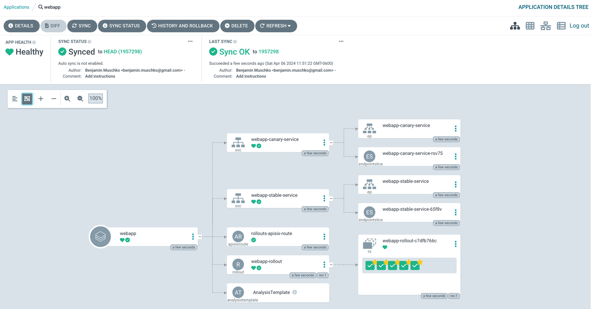
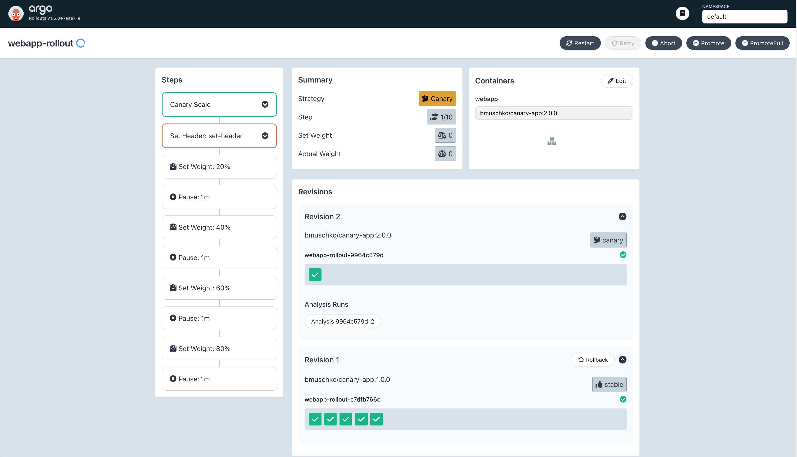
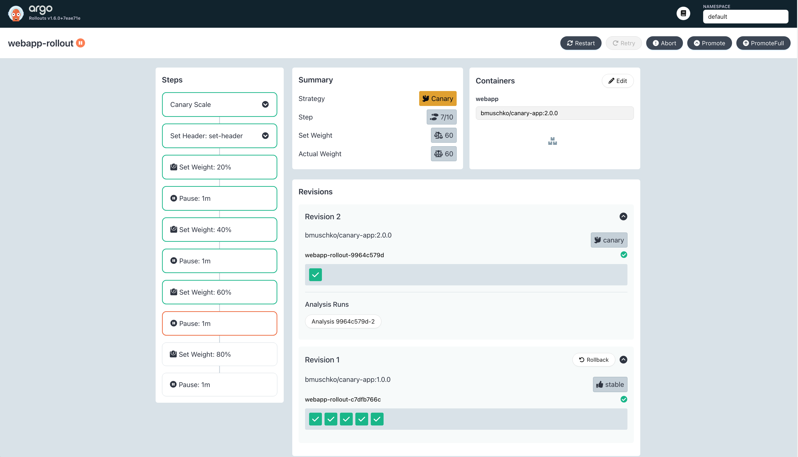
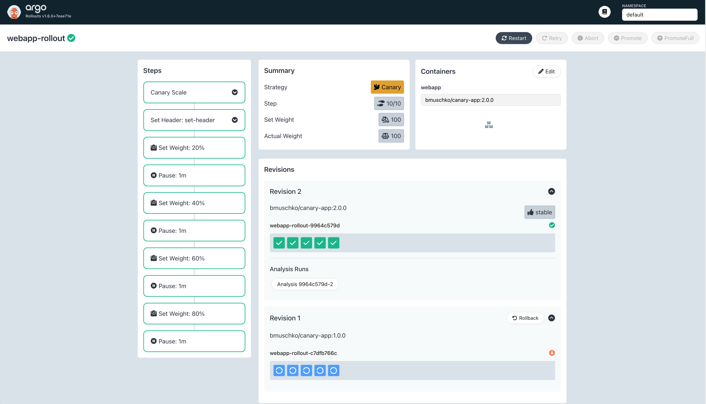

# Solution

Install APISIX and the ingress controller using the shell script `install-apisix.sh`.

```
$ ./install-apisix.sh
"apisix" already exists with the same configuration, skipping
Hang tight while we grab the latest from your chart repositories...
...Successfully got an update from the "apisix" chart repository
Update Complete. ⎈Happy Helming!⎈
NAME: apisix
LAST DEPLOYED: Wed Apr  3 12:53:23 2024
NAMESPACE: ingress-apisix
STATUS: deployed
REVISION: 1
TEST SUITE: None
NOTES:
1. Get the application URL by running these commands:
  export NODE_PORT=$(kubectl get --namespace ingress-apisix -o jsonpath="{.spec.ports[0].nodePort}" services apisix-gateway)
  export NODE_IP=$(kubectl get nodes --namespace ingress-apisix -o jsonpath="{.items[0].status.addresses[0].address}")
  echo http://$NODE_IP:$NODE_PORT
```

Create a new application from the Argo CD UI by clicking the button _New App_. Enter the configuration data given in the instructions. Click the _Create_ button. After manually syncing the application, it should transition into the "Healthy" status.



Listing all rollouts will only show a single one. The rollout defines 10 steps.

```
$ kubectl argo rollouts list rollouts
NAME            STRATEGY   STATUS        STEP   SET-WEIGHT  READY  DESIRED  UP-TO-DATE  AVAILABLE
webapp-rollout  Canary     Healthy       10/10  100         5/5    5        5           5
```

Next up, let's roll out the change of the container image. Run the following imperative command to signal to the Rollout that you want to create a new ReplicaSet that controls replicas with the container image `bmuschko/canary-app:2.0.0`.

```
$ kubectl argo rollouts set image webapp-rollout webapp=bmuschko/canary-app:2.0.0
rollout "webapp-rollout" image updated
```

The Argo Rollouts Dashboard will stop before the first weight step.



Promoting the rollout will make revision 2 active, and route 20% of the traffic to the new revision.

```
$ kubectl argo rollouts promote webapp-rollout
rollout 'webapp-rollout' promoted
```

The analysis run will continue to execute and always return success. Over time, the rollout will automatically promote later steps. The process will pause for 1 minute between steps.



The process will continue until the weight of 100% has been reached. Revision 1 will be ramped down.

