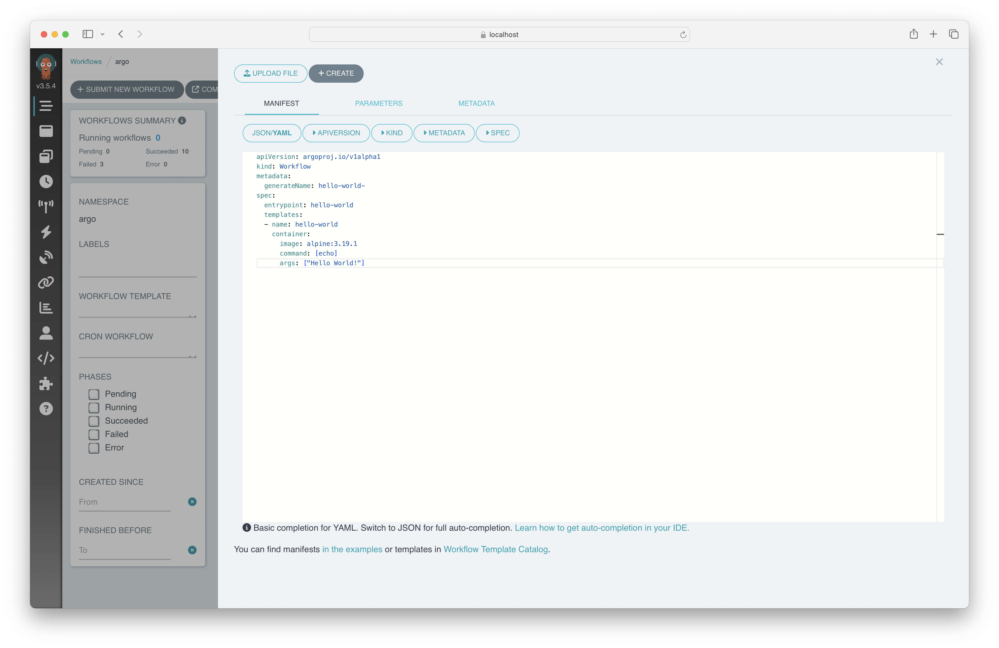
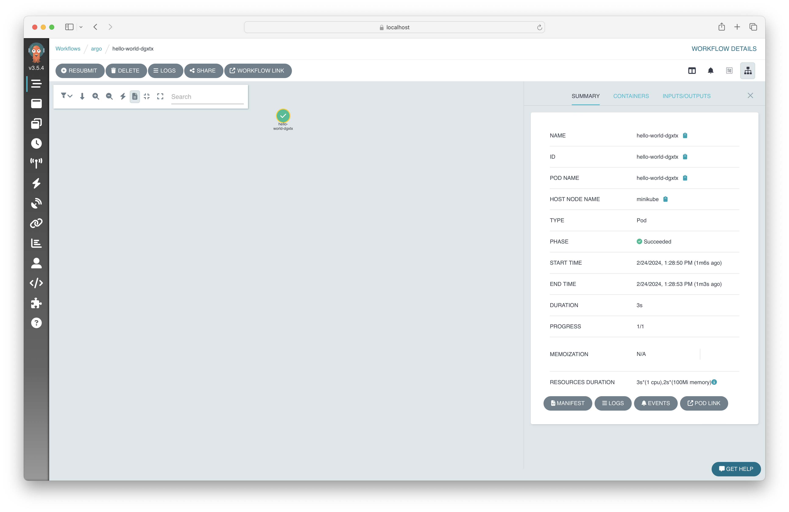

# Solution

Create the file that holds the workflow definition. Edit the contents of the file with the editor of your choice. We are going to use `vim` here.

```
$ touch hello-world.yaml
$ vim hello-world.yaml
```

Start with the following workflow definition.

```yaml
apiVersion: argoproj.io/v1alpha1
kind: Workflow
metadata:
  generateName: hello-world-
spec:
  entrypoint: hello-world
  templates:
  - name: hello-world
    container:
      image: alpine:3.19.1
      command: [echo]
      args: ["Hello World!"]
```

Open the UI of Argo Workflows. Select the option _Workflows > Submit New Workflow > Edit using full workflow options_ and copy the contents of the workflow file into _Manifest_ text box. Alternatively, you can also select the option _Upload File_ and upload the workflow file. Then, press the _Create_ button.



The workflow name should start with the prefix `hello-world-` plus a autogenerated hash and finish successfully indicate by the color green. Click on the name of the workflow in UI and select _Logs_ from the context menu.



The logs should render the desired "Hello World" message.


You can also submit a workflow using the Argo CLI. Run the following command to make this happen.

```
$ argo submit -n argo --watch hello-world.yaml
Name:                hello-world-n7dqt
Namespace:           argo
ServiceAccount:      unset (will run with the default ServiceAccount)
Status:              Succeeded
Conditions:
 PodRunning          False
 Completed           True
Created:             Sat Feb 24 13:34:42 -0700 (11 seconds ago)
Started:             Sat Feb 24 13:34:43 -0700 (10 seconds ago)
Finished:            Sat Feb 24 13:34:53 -0700 (now)
Duration:            10 seconds
Progress:            1/1
ResourcesDuration:   3s*(1 cpu),2s*(100Mi memory)

STEP                  TEMPLATE     PODNAME            DURATION  MESSAGE
 ✔ hello-world-n7dqt  hello-world  hello-world-n7dqt  4s
```

To retrieve the logs of the last workflow execution, run the following command.

```
$ argo logs -n argo -f @latest
custom-message-sdnjf: time="2024-02-28T16:48:49.290Z" level=info msg="capturing logs" argo=true
custom-message-sdnjf: "Provided from the CLI"
custom-message-sdnjf: time="2024-02-28T16:48:50.291Z" level=info msg="sub-process exited" argo=true error="<nil>"
```

Copy the existing workflow YAML manifest to a new file. We are going to use `vim` here.

```
$ cp hello-world.yaml custom-message.yaml
$ vim custom-message.yaml
```

Change the workflow definition so that it can accept a parameter named `message`. Use the parameter to render the passed in value in the `echo` command. Store the definition in a new workflow file name `custom-message.yaml` and change the name to `custom-message-`.

```yaml
apiVersion: argoproj.io/v1alpha1
kind: Workflow
metadata:
  generateName: custom-message-
spec:
  arguments:
    parameters:
      - name: message
        value: Hello World!
  entrypoint: hello-world
  templates:
  - name: hello-world
    inputs:
      parameters:
        - name: message
          value: "{{workflow.parameters.message}}"
    container:
      image: alpine:3.19.1
      command: [echo]
      args: ["{{inputs.parameters.message}}"]
```

Use the `-p` command line flag to pass a value for the parameter `message`. The command below provides the message "Provided from the CLI".

```
$ argo submit -n argo -p 'message="Provided from the CLI"' --watch custom-message.yaml
```