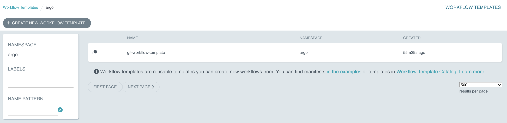

# Solution.

Create the file that holds the workflow template definition. Edit the contents of the file with the editor of your choice. We are going to use `vim` here.

```
$ touch git-workflow-template.yaml
$ vim git-workflow-template.yaml
```

Ensure that the `kind` attribute uses WorkflowTemplate instead of Template. You will want to make sure that all configurable attributes have been exposed by input parameters with sensible defaults. I actually decided to remove the default value from the `repo` attribute and use the more branch `main` as the default value for the `branch` attribute. The definition of the Git clone template looks exactly as before.

```yaml
apiVersion: argoproj.io/v1alpha1
kind: WorkflowTemplate
metadata:
  name: git-workflow-template
  namespace: argo
spec:
  arguments:
    parameters:
      - name: repo
      - name: branch
        value: main
      - name: cloneDepth
        value: 1

  templates:
  - name: checkout
    dag:
      tasks:
        - name: checkout
          template: git-clone
          arguments:
            parameters:
              - name: repo
                value: "{{workflow.parameters.repo}}"
              - name: branch
                value: "{{workflow.parameters.branch}}"
              - name: cloneDepth
                value: "{{workflow.parameters.cloneDepth}}"

  - name: git-clone
    inputs:
      parameters:
        - name: repo
        - name: branch
        - name: cloneDepth
    container:
      volumeMounts:
        - mountPath: /work
          name: work
      image: alpine/git:v2.43.0
      workingDir: /work
      args:
        - clone
        - --depth
        - "{{inputs.parameters.cloneDepth}}"
        - --branch
        - "{{inputs.parameters.branch}}"
        - --single-branch
        - "{{inputs.parameters.repo}}"
        - .
```

You can add the template via the UI or command line. From the UI, select the option _Workflow Templates > Create New Workflow Template_. Paste the contents of your WorkflowTemplate into the text field and click the _Create_ button. Argo now lists the WorkflowTemplate.



Alternatively, you can also submit the WorkflowTemplate with the following command.

```
$ kubectl apply -f git-workflow-template.yaml
workflowtemplate.argoproj.io/git-workflow-template created
```

Modify the existing workflow so that it uses the reference of the WorkflowTemplate. Instead of using `spec.templates[].dag.tasks[].template`, you'd use `spec.templates[].dag.tasks[].templateRef`.

```yaml
apiVersion: argoproj.io/v1alpha1
kind: Workflow
metadata:
  generateName: go-build-
spec:
  arguments:
    parameters:
      - name: repo
        value: https://github.com/bmuschko/calc
      - name: branch
        value: master
      - name: cloneDepth
        value: 1

  volumeClaimTemplates:
    - metadata:
        name: work
      spec:
        accessModes: ["ReadWriteOnce"]
        resources:
          requests:
            storage: 64Mi

  entrypoint: checkout

  templates:
  - name: checkout
    dag:
      tasks:
        - name: checkout
          templateRef: 
            name: git-workflow-template
            template: git-clone
          arguments:
            parameters:
              - name: repo
                value: "{{workflow.parameters.repo}}"
              - name: branch
                value: "{{workflow.parameters.branch}}"
              - name: cloneDepth
                value: "{{workflow.parameters.cloneDepth}}"
        - name: build
          template: go-build
          dependencies: [checkout]

  - name: go-build
    container:
      volumeMounts:
        - mountPath: /work
          name: work
      image: golang:1.22.0-alpine3.18
      workingDir: /work
      args:
        - go
        - build
```

Submit the workflow using the following command.

```
$ argo submit -n argo go-build-workflow.yaml
Name:                go-build-77jpr
Namespace:           argo
ServiceAccount:      unset (will run with the default ServiceAccount)
Status:              Pending
Created:             Sat Mar 02 09:39:29 -0700 (now)
Progress:
Parameters:
  repo:              https://github.com/bmuschko/calc
  branch:            master
  cloneDepth:        1
```