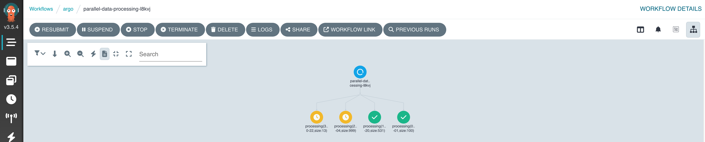

# Solution

Create the file that holds the workflow template definition. Edit the contents of the file with the editor of your choice. We are going to use `vim` here.

```
$ touch data-processing.yaml
$ vim data-processing.yaml
```

Define the input parameter to the workflow that used the JSON structure.

```yaml
...
spec:
  arguments:
    parameters:
      - name: json-data
        value: |
          [
              {"date": "2024-03-01", "size": 100},
              {"date": "2024-05-20", "size": 531},
              {"date": "2024-07-04", "size": 999},
              {"date": "2024-10-22", "size": 13}
          ]
```

Add a template for processing the JSON structure element by element. Use the attribute `withParam` to point to the JSON data input. Specify the value 2 for the `parallelism` attribute to execute the two steps at a time in parallel.

```yaml
...
  templates:
  - name: worker
    parallelism: 2
    inputs:
      parameters:
        - name: json-data
    steps:
    - - name: processing
        template: json-parsing
        arguments:
          parameters:
            - name: data-item
              value: "{{item}}"
        withParam: "{{inputs.parameters.json-data}}"
```

The template execution runs in a container. Make sure to define appropriate command arguments.

```yaml
...
  - name: json-parsing
    inputs:
      parameters:
      - name: data-item
    container:
      image: bmuschko/bash-jq:1.0.0
      args: ["-c", "echo '{{inputs.parameters.data-item}}' | jq '.size'"]
```

The visualization of the workflow in progress will execution two steps at a time.

